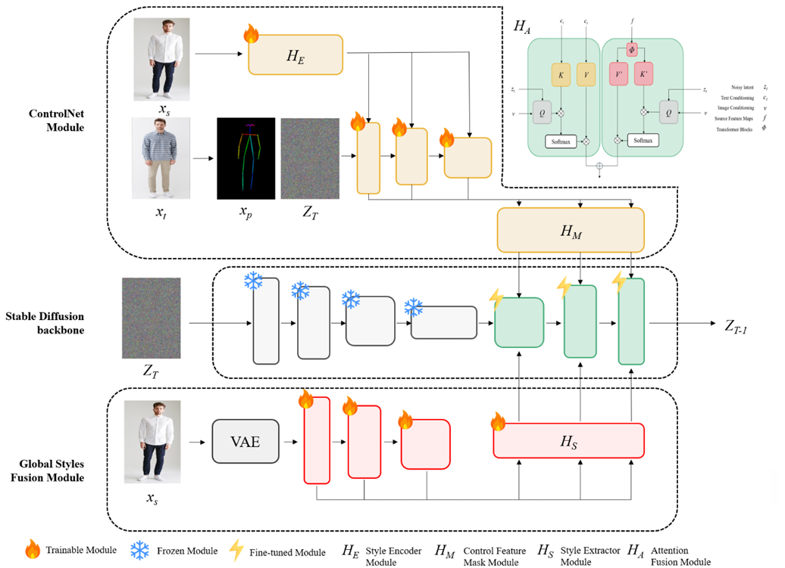
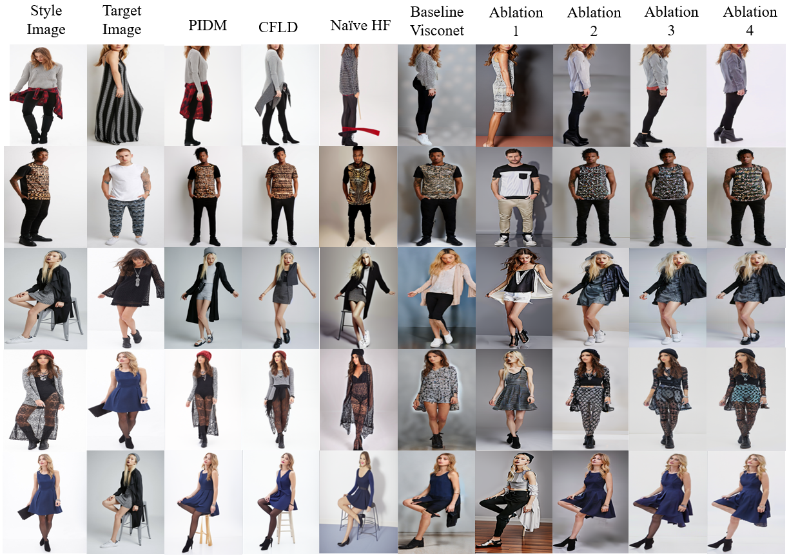

<a name="readme-top"></a>

## *ViscoNet2*: Improved Visconet for Generalised Human Pose Transfer

<!-- TABLE OF CONTENTS -->
<details>
  <summary>Table of Contents</summary>
  <ol>
    <li>
      <a href="#about-the-project">About The Project</a>
      <ul>
        <li><a href="#proposed-architecture">Proposed Architecture</a></li>
        <li><a href="#results">Results</a></li>
      </ul>
    </li>
    <li>
      <a href="#getting-started">Getting Started</a>
<!--       <a href="#files">Files</a> -->
    </li>
    <li><a href="#acknowledgements">Acknowledgements</a></li>
  </ol>
</details>

<!-- ABOUT THE PROJECT -->
## About The Project

The aim of this project was to implement a novel model architecture that incorporated the 
latest image prompt adapters, mainly ControlNet and IP-Adapter, with pre-trained text-to-image models to perform Human Pose Transfer using multi-modality prompts. Building upon [Visconet](https://github.com/soon-yau/visconet), the proposed model architecture is able to incorporate both text and image conditioning to perform Human Pose Transfer over a diverse range of samples.

<p align="right">(<a href="#readme-top">back to top</a>)</p>

<!-- PROPOSED ARCHITECTURE -->
## Proposed Architecture


<p align="center"><em>Proposed Model Architecture</em></p>

Our proposed architecture contains of two modules, the ControlNet Module and the Global Styles Fusion Module. The ControlNet Module contains the improved Style Encoder Sub-Module *H<sub>E</sub>* and the Control Feautre Mask Module *H<sub>M</sub>* while the Global Styles Fusion Module contains the Style Extractor Sub-Module *H<sub>S</sub>* and the Attention Fusion Module *H<sub>A</sub>*. 

Meanwhile, the original Visconet contains only the ControlNet module with the original Style Encoder Sub-Module *H<sub>E,0</sub>*.

<p align="right">(<a href="#readme-top">back to top</a>)</p>

<!-- RESULTS -->
## Results
<div align="center">

  

</div>
<p align="center"><em>Results obtained from the chosen baselines and each ablation</em></p>

<div align="center">

| Model | SSIM (↑)  | FID (↓)  | LPIPS (↓) |
| ----------- | ----------- | ----------- | ----------- | 
| PIDM **(B)** | 0.656 | 0.390 | 0.184 | 
| CFLD **(B)** | 0.660 | 0.195 | 0.183 |
| Naive HF implementation **(B)** | 0.566 | 7.250 | 0.234 |
| Baseline Visconet **(B)** | 0.401 | 9.790 | 0.306 |
| Ablation 1 | 0.407 | 8.004 | 0.308 |
| Ablation 2 | 0.467 | 6.566 | 0.266 |
| Ablation 3 | 0.538 | 1.557 | 0.242 |
| Ablation 4 | 0.541 | 1.604 | 0.243 |

</div>
<p align="center"><em>Metrics obtained from the chosen baselines, denoted with **(B)**, and each ablation</em></p>

<p align="right">(<a href="#readme-top">back to top</a>)</p>

<!-- GETTING STARTED -->
## Getting Started

A suitable [conda](https://conda.io/) environment named `control` can be created and activated with:

```
conda create -n control python=3.8.5
conda activate control
```

Download all necessary requirements with:

```
pip install -r requirements.txt
```

To perform inference on a single pair of images, run `inference.py`. A sample command is provided below:

```
python3 -u inference.py <src_image_fp> <tgt_image_fp> --output_dir=<path/to/output/dir>  --gpu 0 --config=<path/to/config/file> --ckpt=<path/to/ckpt/file> --prompt='<text_prompt>' --n_prompt='<negative_text_prompt>' --ddim_steps=<num_ddim_steps> --cfg_scale=<cfg_scale>
```

To perform inference on a batch of samples, run `test.py`. A sample command is provided below:

```
python3 -u test.py --name=<project_name> --config=<path/to/config/file> --resume_path=<path/to/ckpt/file> --batch_size=<num_batch_size> --gpus 0
```

To train the model, run `train.py`. A sample command is provided below:

```
python3 -u train.py --name=<project_name> --config=<path/to/config/file> --resume_path=<path/to/ckpt/file> --gpus <list of gpu indexes> --max_epochs=<num_max_epoch> --batch_size=<num_batch_size>
```

<p align="right">(<a href="#readme-top">back to top</a>)</p>

<!--
## Files
-->

### Acknowledgements
This project is based on the work done in [Visconet](https://github.com/soon-yau/visconet).  
Special thanks to the original authors for their contributions.

<p align="right">(<a href="#readme-top">back to top</a>)</p>
